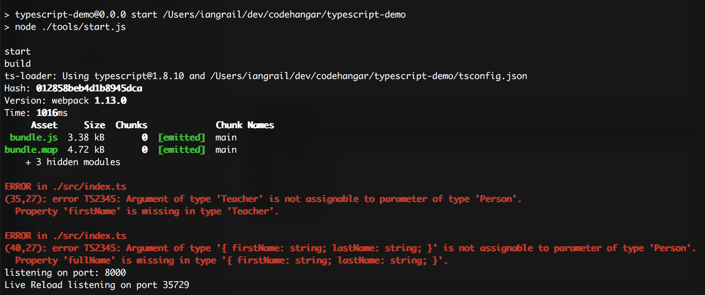
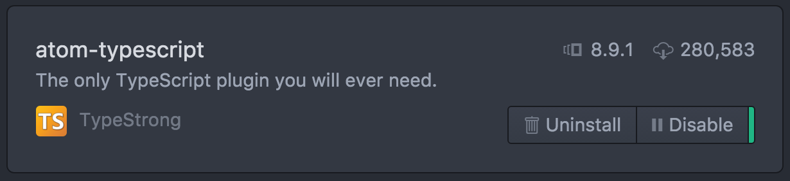

# TypeScipt Demo

Companion demo repository for the below article:
http://codehangar.io/exploring-typescript/

Based off of the getting started tutorial found here https://www.typescriptlang.org/docs/tutorial.html

## Running the app
- Clone this repository
- From Terminal, Run `npm install`
- From Terminal, Run `npm start`

You should see the below output in your Terminal

_Note the TypeScript errors. This repository intentionally has errors in order to highlight TypeScript's type-checking abilities and error reporting_

## Using TypeScript in Atom Editor
- If you are not using Atom, download it here: https://atom.io/
- Install the `atom-typescript` atom package:

